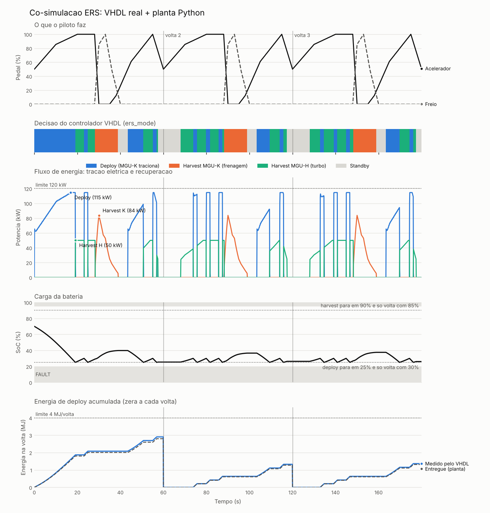

# ERS Simulation Project

Simulador de Sistema de Recuperação de Energia (ERS) inspirado em regulamentos de Formula 1, implementado em VHDL com co-simulação Simulink/ModelSim e co-simulação livre GHDL + Python (cocotb).

## Objetivo

Projeto acadêmico que demonstra o funcionamento de um controlador eletrônico embarcado de alta exigencia temporal, aplicado ao gerenciamento de energia em um carro de corrida. O sistema decide quando recuperar energia (frenagem e turbo) e quando injeta-la na tração, respeitando limites rígidos do regulamento.

## Arquitetura do Sistema

```
+---------------------------+          +----------------------------+
|   Simulink (Planta)       |   TCP    |   ModelSim (Controlador)   |
|                           | <------> |                            |
|  - MGU-K (freio)          |  HDL     |  ers_top.vhd               |
|  - MGU-H (turbo)          | Cosim    |   +-- ers_fsm.vhd          |
|  - Bateria HV (RC 1a ord) |          |   +-- pi_controller.vhd    |
|  - Cenario de corrida     |          |   +-- power_arbiter.vhd    |
+---------------------------+          |   +-- energy_meter.vhd      |
                                       +----------------------------+
```

## Restrições do Regulamento Simulado

| Parametro                       | Limite     |
|---------------------------------|------------|
| Energia máxima por volta        | 4 MJ       |
| Potência máxima deploy (MGU-K)  | 120 kW     |
| Potência máxima harvest (MGU-K) | 120 kW     |
| SoC mínimo da bateria           | 20%        |
| SoC maximo da bateria           | 95%        |
| Tensão nominal barramento HV    | 400 V      |

## Ferramentas

| Ferramenta           | Funcao                                          |
|----------------------|-------------------------------------------------|
| GHDL                 | Simulação livre do VHDL (testes automatizados/CI) |
| Python + cocotb      | Planta física e co-simulação livre com o VHDL     |
| ModelSim / Questa    | Simulação e verificação do VHDL                  |
| MATLAB / Simulink    | Modelo físico do veículo e co-simulacao          |
| Simscape Electrical  | Modelagem dos componentes elétricos              |
| HDL Verifier         | Bloco de co-simulação entre Simulink e ModelSim  |

## Estrutura do Projeto

```
ers_project/
+-- README.md
+-- docs/
|   +-- 01_introducao.md
|   +-- 02_modelo_fisico.md
|   +-- 03_arquitetura_vhdl.md
|   +-- 04_cosimulacao.md
|   +-- 05_resultados.md
+-- simulink/
|   +-- vehicle_model.slx
|   +-- cosim_top.slx
+-- vhdl/
|   +-- ers_fsm.vhd
|   +-- pi_controller.vhd
|   +-- power_arbiter.vhd
|   +-- energy_meter.vhd
|   +-- ers_top.vhd
+-- testbench/
|   +-- tb_ers_fsm.vhd
|   +-- tb_pi_controller.vhd
|   +-- tb_power_arbiter.vhd
|   +-- tb_energy_meter.vhd
|   +-- tb_ers_top.vhd
+-- cosim/                (co-simulação GHDL + Python)
|   +-- plant.py
|   +-- test_ers_cosim.py
|   +-- run_cosim.py
|   +-- plot_results.py
|   +-- hdl/ers_cosim_wrapper.vhd
+-- scripts/
    +-- run_tests.sh      (GHDL)
    +-- compile_all.do
    +-- sim_standalone.do
    +-- sim_cosim.do
```

## Documentação

- [Introdução e Motivação](docs/01_introducao.md)
- [Modelo Físico (Simulink)](docs/02_modelo_fisico.md)
- [Arquitetura VHDL](docs/03_arquitetura_vhdl.md)
- [Co-simulação](docs/04_cosimulacao.md)
- [Resultados e Análise](docs/05_resultados.md)
- [Co-simulação com Planta Python](docs/06_cosimulacao_python.md)

## Convenções de Código VHDL

- `snake_case` para sinais e portas; `UPPER_CASE` para constantes e generics
- Clock: `rising_edge(clk)`; reset assíncrono: `if rst_n = '0'`
- Biblioteca: `numeric_std` (nunca `std_logic_arith`)
- Ponto fixo: formato Q documentado em cada sinal
- Cabeçalho obrigatorio em cada arquivo

## Status

- [x] Etapa 1 -- Estrutura do projeto e documentação inicial
- [x] Etapa 2 -- Modelo físico no Simulink
- [x] Etapa 3 -- Implementacao VHDL (FSM, PI, Arbiter, Energy Meter, Top)
- [x] Etapa 4 -- Co-simulação (Simulink + placeholder / HDL Verifier)
- [x] Etapa 5 -- Análise de resultados e documentação final

- [x] Etapa 6 -- Co-simulação livre: VHDL real (GHDL) + planta Python (cocotb), no CI

Veja [docs/05_resultados.md](docs/05_resultados.md) e [docs/06_cosimulacao_python.md](docs/06_cosimulacao_python.md).

## Resultados Principais

| Métrica | Limite | Observado | Status |
|---------|--------|-----------|--------|
| Energia deploy / volta | <= 4 MJ | 3.82 MJ | Aprovado |
| Potência MGU-K pico | <= 120 kW | 83.8 kW | Aprovado |
| Potência MGU-H pico | <= 50 kW | 50.0 kW | Aprovado |
| Potência deploy pico | <= 120 kW | 120.0 kW | Aprovado |
| SoC min / max | [20%, 95%] | [25%, 70%] | Aprovado |

> Os valores acima vêm da co-simulação em modo **placeholder** (controlador emulado em Simulink), não do VHDL. Veja [docs/05_resultados.md](docs/05_resultados.md), seção 5.6.

### Com o controlador VHDL real (co-simulação Python)

| Volta | Deploy entregue | Harvest | SoC no fim |
|-------|-----------------|---------|------------|
| 1 | 2.80 MJ | 1.01 MJ | 25.4% |
| 2 | 1.27 MJ | 1.31 MJ | 26.3% |
| 3 | 1.31 MJ | 1.30 MJ | 26.0% |

O regulamento é respeitado (sem FAULT, deploy ≤ 4 MJ/volta, ≤ 120 kW, SoC em [20%, 95%]), mas a partir da volta 2 o carro só gasta o que recupera. A co-simulação revelou dois problemas do controlador, já corrigidos: oscilação da FSM no limite de SoC (agora com histerese 25%/30%) e salto de potência ao reentrar em deploy (agora o PI parte do setpoint). Detalhes em [docs/06_cosimulacao_python.md](docs/06_cosimulacao_python.md).



**Testbenches VHDL:** 5/5 passando no GHDL (ers_fsm, pi_controller, power_arbiter, energy_meter, ers_top), rodando automaticamente no GitHub Actions a cada push. Os testbenches são auto-verificáveis: conferem valores numéricos de energia, saturação/anti-windup do PI, oscilação do PWM e o corte de deploy em 4 MJ/volta.

## Como Reproduzir

```matlab
% 1. Modelo fisico standalone
create_vehicle_model
validate_standalone

% 2. Co-simulacao (placeholder)
create_cosim_top
out = sim('cosim_top');
analyze_cosim_results
```

```bash
# Testbenches VHDL (GHDL, livre)
./scripts/run_tests.sh

# Co-simulação VHDL + planta Python (GHDL + cocotb)
pip install -r cosim/requirements.txt
python cosim/run_cosim.py
python cosim/plot_results.py
```

```tcl
# Testbenches VHDL (ModelSim)
cd ers_project/scripts
do compile_all.do
do sim_standalone.do
```
